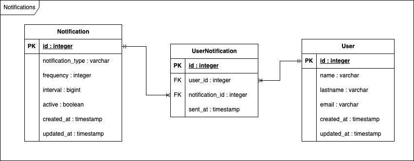

# Rate-Limited Notification Service

This repository contains my solution to the technical challenge as part of an interview process for a software engineer position.

## Explanation of my solution

The challenge required the design and implementation of a system that:

> ...sends out email notifications of various types (status update, daily news, project invitations, etc). We need to protect recipients from getting too many emails, either due to system errors or due to abuse, so let’s limit the number of emails sent to them by implementing a rate-limited version of NotificationService.

Below is a detailed explanation of the solution:

- **Design Approach:** The system is designed using a strategy pattern, that through the interface `NotificationInterface` (`lib/interfaces/notifications_interface.rb`) an implementation contract is defined in the send function so that all the concrete classes implement that method. In this case, the `NotificationService` class (`app/service/notification_service.rb`) implements this contract with the particularity that it establishes the message sending rate limitation given a parameterization of the maximum sending frequency.
- **Core Functionality:** This solution provides a set of REST services. The main endpoint (`POST /notifications/send`) receives as input an object like the following:

```json
{
    “notification": {
        “user_id": 1,
        “type": ‘design’,
        “message": ”Hello world!”
    }
}
```

Where `user_id` is the user to which the notification will be sent, `type` is the type of notification that has a rate-limit configuration set in the notifications table and `message` is the content of the message to be sent. The response of this call will have a status code `200 OK` when the notification can be sent, and a `500 Internal Server Error` when the sending of the notification is rejected by a rate limit. In addition, there is a complete set of endpoints that implement all CRUD operations for users and notifications.

- **Challenges and Decisions:** One of the most important challenges to solve is to represent rate-limit constraints, which can be as varied as “not more than 2 per minute for each recipient” or “not more than 3 per hour for each recipient”. This representation (taking as an example the cases cited above) the frequency, such as 2 or 3, and the time interval, such as seconds, minutes, hours. To accomplish this, in the following section the data model is discussed in more detail.

## Entity-Relationship Diagram

Below is the Entity-Relationship Diagram that represents the data model used in the system:



- Notification:
  - notification_type: A string representing the types of notifications in the system, like `marketing`, `projects`, etc.
  - frequency: An integer representing the maximum amount of notifications to be sent in a given interval.
  - interval: An integer (BigInteger) is the representation of the time interval in which a maximum number of messages can be sent; it is defined in seconds. For example, if a notification is rate-limited to 2 every minute, the interval value must be 60. If a notification is rate-limited to 1 every 15 minutes, the interval value must be 900.
  - active: A boolean value that is used to turn off a rate-limit rule due to referential integrity; records in this table cannot be deleted.
  - created_at: Date and time a record is created
  - updated_at: Date and time a record is updated
- User:
  - name: A string value that represents a user's name
  - lastname: A string value that represents a user's lastname
  - email: A string value that represents a user's email
  - created_at: Date and time a record is created
  - updated_at: Date and time a record is updated
- UserNotification:
  - user_id: An integer foreign key that relates to User entity
  - notification_id: An integer foreign key that relates to Notification entity
  - sent_at: Date and time a message is sent


## Software Used

The following software and libraries were used in this project:

- **Programming Language:** Ruby 3.1.2
- **Frameworks:** Ruby on Rails 7.1.3
- **Database:** PostgreSQL
- **Testing:** Minitest (built-in unit testing), Postman (REST services)
- **Other Tools:** Docker and Docker Compose

## Initial Setup

Follow the steps below to set up and run the project locally:

1. **Clone the repository:**
   ```bash
   git clone https://github.com/luegilca/modak_challenge
   cd modak_challenge
   ```
   
2. **Set environment variables:**
   You will find a fille called `.example.env` that looks like this:
   ```
   DB_HOST=
   DB_USERNAME=
   DB_PASSWORD=
   APP_PORT=3000
   RAILS_ENV=development
   ```
   Which serves a example for the `.env` file that you **must create** at the root directory of this project, it should look like this:
   ```
   modak_challenge/
   │   .env
   │   README.md
   │   .example.env  
   │   ...
   │
   └───app/
   └───bin/
   └───config/
   └───...
   ```
   You can copy the `.example.env` content into `.env`, the missing values for `DB_HOST`, `DB_USERNAME` ,`DB_PASSWORD`  must be according to the definitions in the `docker-compose.yml` file, if you used the same configuration of this repository, the file should look like this: 
   ```
   DB_HOST=notifications-db
   DB_USERNAME=modak
   DB_PASSWORD=m0dak*
   APP_PORT=3000
   RAILS_ENV=development
   ```

3. **Compile the project:**
   ```bash
   sh start.sh
   ```
   or, if you want to use docker commands
   ```bash
   docker compose build && docker compose up -d
   ```   
   Once images are generated and containers are running you should see this output in the console:
   
   ```
   [+] Running 4/4
   ✔ Network notifications_backend		Cr...                                 0.0s 
   ✔ Container notifications_db			Start...                              0.6s 
   ✔ Container notifications_api		Star...                               1.0s
   ```
   
   After, execute this commands to initialize database:

4. **Create, migrate and seed database:**
   ```bash
   docker exec --tty notifications_api bin/rails db:create
   docker exec --tty notifications_api bin/rails db:migrate
   docker exec --tty notifications_api bin/rails db:seed
   ```

5. **Run unit tests (Optional):**
   ```bash
   docker exec --tty notifications_api bin/rails test
   ```

## Testing services with Postman

Import given file `Modak Tech Challenge.postman_collection.json` into Postman to access a collection with saved requests and example responses for all the available endpoints in this projects.

---

Thank you for reviewing my solution! Please feel free to reach me out with any questions or feedback at my [email](mailto:luergica@gmail.com).
